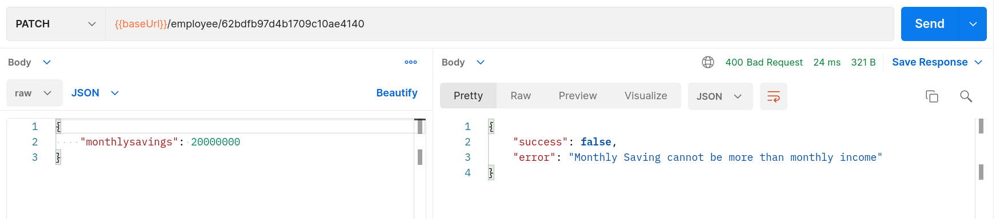
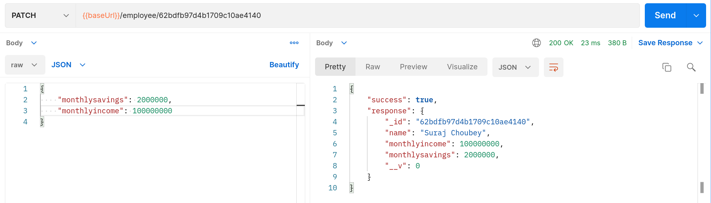

# at-backend-task

## Task1: Searching Slangs which are location specific
1. To get the location we need to get users location from client side.
2. Use some API like Mapbox to fetch users location, or let user enter some custom location in order to search the specific slang.
3. Use a dictionary API like Urban Dictionary or something or even google search straight would do the job.

## Task2: Monthly Savings <= Monthly Income

1. Before saving into the database, we add a clause so the above inequality is always obeyed while making `POST`, `PATCH` requests.

## Task3: Large Form Collection.

1. Saving everything into CSV so we can research and develop models.

## Task4: Generate receipt when ingestion turns true

1. We add a clause, before saving in the database receipt's ingestion is turned on true like a switch we generate a receipt and send it to user

